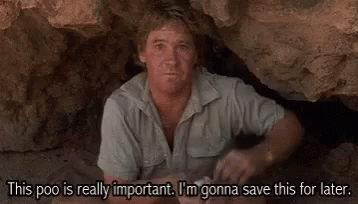

# Welcome to my R Scrapheap

I use R on a daily basis and fairly regularly I run into re-occuring problems. After years of frantically searching through various scripts to see how I solved it last time, I have decided to compile (sometimes) useful bits of code that I might need again.

##### *That ugly chunk of code you really should delete, but can't bring yourself to do it, so you 'comment' it out instead:*

Who knows... maybe they are useful for other people too!

 
## Phylogenetics and Systematics

* Sometimes ultrametric trees aren't really ultrametric for something as trivial as branch lengths having different decimal places. Here is a quick fix.. [Be ultrametric, damnit!!](./be_ultrametric.html).

* Check out [AmphiNom](https://github.com/hcliedtke/AmphiNom), an R package for working with the Amphibian Species of the World database for amphibian systematics

## Others
